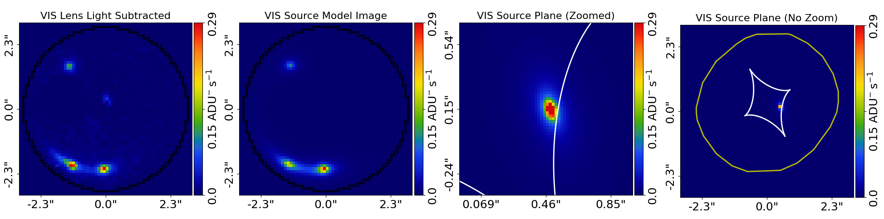

# Aggregator Agent

Experimental LLM based tools to tackle problems processing large volumes of gravitational lenses
in [AutoLens](https://github.com/Jammy2211/PyAutoLens).

## Scripts

### Predict Directory

Create a CSV predicting whether each lensing output image in a directory contains an actual gravitational lens and how
well it was fit.

Usage:

```bash
predict_directory.py  "/path/to/lensing/images"
```

Images must contain lens subtracted and model output as below:



### Performance Test

Run a test against a large number of images where the ground truth is known. Ground truth is given in image_analysis.csv

It is assumed corresponding images are found in `data/initial_lens_model`.

Usage:

```bash
performance_test.py
```

### View Mismatched Results

Show results output by the performance test along with images.

Usage:

```bash
view_mismatched_results.py --csv "results.csv" --image-root "data/initial_lens_model"
```

### Check One

Run inference on a single image from the `data/initial_lens_model` directory.

Usage:

```bash
check_one.py 102160611_2740328687682808789
```

In this case only the image ID needs to be passed. It is the same as the filename without the png suffix.